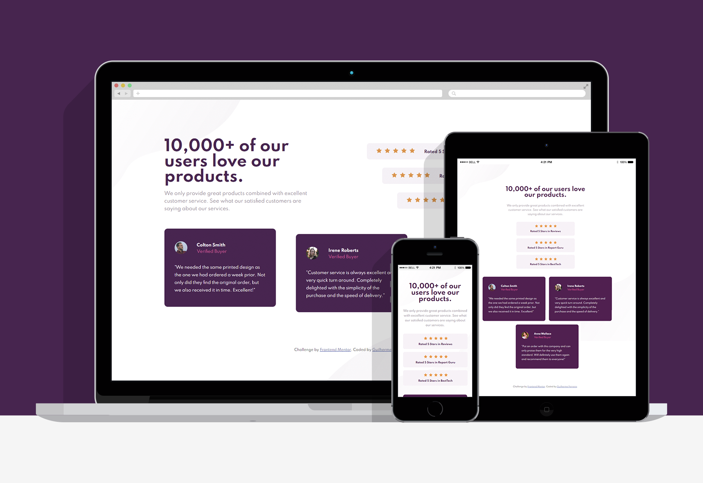

# | Social Proof Section Solution
## This is a solution to the [Social proof section challenge on Frontend Mentor](https://www.frontendmentor.io/challenges/social-proof-section-6e0qTv_bA). 
### Project/Challange proposal: Users should be able to view the optimal layout for the section depending on their device's screen size.

  

# | Screenshots

 

# | Live View
- [Live Site Link](https://guilhermerera.github.io/social-proof-section-master%20(html5%20css3%20flexbox)/)
- [FrontEnd Mentor Solution](https://www.frontendmentor.io/solutions/social-proof-section-using-html5-and-css3-flex-box-_xzcRBj1V)

 

# | What I learned
How to use flex box in a structure and how a flex container and flex items work with block and inline-block elements. I also tried to optmize my CSS with common classes, media queries and pseudo elements.

~~~css
.nameWrap::before {
  content: "";
  float: left;
  border-radius: 50%;
  width: 40px;
  height: 40px;
  background-repeat: no-repeat;
  background-size: cover;
  margin-right: 25px;
}

.nW1::before {
  background-image: url(../images/image-colton.jpg);

}

.nW2::before {
  background-image: url(../images/image-irene.jpg);
}

.nW3::before {
  background-image: url(../images/image-anne.jpg);
}
~~~

 

# | Built With
     

 

# | Find Me
  